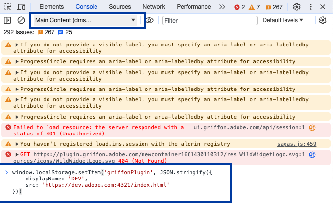
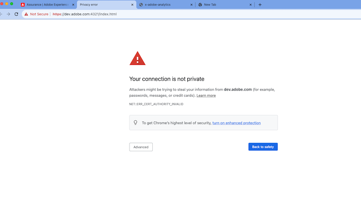
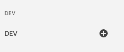

# assurance-plugins

assurance-plugins is a monorepo that contains templates, components, and utilities for building plugins for Assurance, as well as several open source plugins.

## Development

### Setup

After checking out the repo, simply run in the root folder

```bash
yarn
```

Then build the components with

```bash
yarn build --ignore sample-ui-plugin
```
> Note: it requires to use node "^16.14.2 || ^18.13.0". <br>
e.g nvm use 18

---

### Serving Files

Navigate to the plugin directory you'd like to test against and run

```
yarn start
```
> Note: Sample plugin locates at /packages/ui-plugins/sample-ui-plugin <br>
e.g yarn workspace sample-ui-plugin start <br>
 (run from root folder)


This will host your plugin at `https://dev.adobe.com:4321`

Now, we'll configure Assurance to work with these local files. Open up [Assurance in the dev mode](https://experience.adobe.com/?devMode=true) and browse to Data Collection > Assurance.

---
> **_NOTE:_**  If you are developing a plugin on the production envrionment that you will need to load Assurance with the `devMode=true` query parameter (https://experience.adobe.com/?devMode=true#) and use an *.adobe.com domain for your plugin. You can add add `dev.adobe.com` to point to `localhost` (/etc/hosts) by executing this shell command: `echo "127.0.0.1 dev.adobe.com" | sudo tee -a /etc/hosts`_ 

> **_NOTE:_**  A UUID value of `dev` will automatically be assigned to the plugin and that same value will be used for the annotation type._
---
Now, in Assurance, open the browser developer console and then select a session. make sure to choose the Assurance context (it will likely be called `Main Content` and is contained in the `top` context).

Now in the console input, you'll enter the following:
```javascript
window.localStorage.setItem('griffonPlugin', JSON.stringify({
    displayName: 'DEV',
    src: 'https://dev.adobe.com:4321/index.html'
}))
```


---
> **_NOTE:_** For the first time, you may need to bypass the secure connection with the https://dev.adobe.com:4321/index.html site for it to connect. In Chrome, click the `Advanced` button and choose to proceed to the domain.



---

The last step will be to add the plugin to your session in the Assurance UI. In the left panel click the `Configure` button and then add the Dev plugin.


